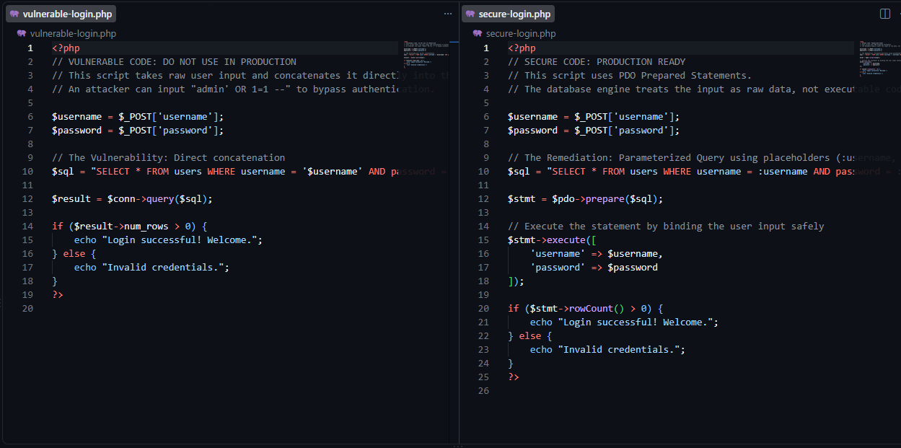

### Summary
Conducted a secure code review and remediated a critical SQL Injection (SQLi) vulnerability in legacy web application architecture.

### Environment
* **Platform:** GitHub Codespaces
* **Concepts:** Application Security (AppSec), OWASP Top 10, SQL Injection (SQLi), Secure Coding, Parameterized Queries (Prepared Statements), PHP/PDO.

### Diagnostic / Execution Steps
1. Audited a legacy authentication script (`vulnerable-login.php`) and identified a critical SQL Injection flaw caused by direct concatenation of raw user input into the database query.
2. Analyzed the risk of authentication bypass (e.g., `admin' OR 1=1 --`) and potential data exfiltration.
3. Authored a remediated script (`secure-login.php`) utilizing PHP Data Objects (PDO).
4. Implemented Parameterized Queries (Prepared Statements) to strictly separate executable SQL code from user-supplied data, neutralizing the injection vector.

### Evidence

### Lessons Learned
Relying on client-side validation or simple string escaping is insufficient for robust application security. Implementing prepared statements at the database driver level is the only definitive method for preventing SQL Injection attacks.
